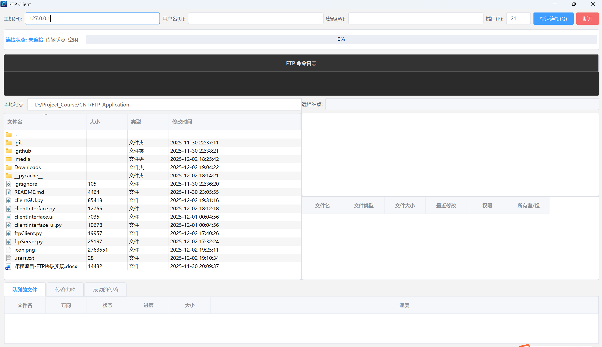
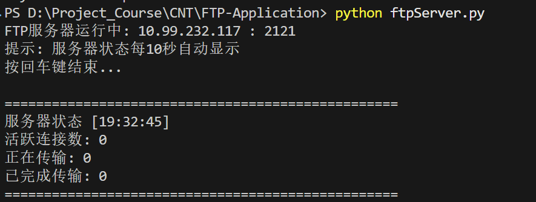

# FTP-Application
一个基于 Python3 socket 的 FTP 应用程序，支持递归文件夹传输和多线程并发下载

## 界面预览

### 客户端界面


### 服务器输出


## 功能特性
- ✅ Windows 环境下运行
- ✅ 支持文件和文件夹的递归上传/下载
- ✅ 支持多用户、多线程并发传输
- ✅ PyQt6 现代化中文界面，Element UI 风格设计
- ✅ 实时队列管理系统（排队/失败/成功）
- ✅ 文件级传输进度显示
- ✅ 拖放上传/下载支持
- ✅ 远程目录树形视图和文件列表
- ✅ 服务器端显示连接数和传输状态
- ✅ 自定义应用图标支持

### 1. 运行环境要求:
  * [PyQt6](https://pypi.org/project/PyQt6/) - 图形用户界面 (已从 PyQt5 升级)
  * [Python3](https://realpython.com/installing-python/) - Python 3.7+
### 2. 安装
* 克隆仓库:
   ```powershell 
   git clone https://github.com/WowJokerH/FTP-Application.git
   ```
* 进入应用目录:
    ```powershell 
    cd FTP-Application
    ```
* 安装依赖（如果尚未安装 PyQt6）:
    ```powershell
    pip install PyQt6
    ```

### 3. 运行程序
##### 3.1 启动服务器
* **Windows 用户** (推荐方式 - 使用非特权端口 2121):
  ```powershell
  python ftpServer.py
  ```
  * 默认端口已改为 **2121**（非特权端口，无需管理员权限）
  * 如需使用标准 FTP 端口 21，请修改 `ftpServer.py` 中 `Main()` 函数的 `serverPort = 2121` 为 `serverPort = 21`，并以管理员权限运行

* **Linux/Mac 用户**:
  ```sh
  # 使用端口 2121（推荐）
  python3 ftpServer.py
  
  # 或使用端口 21（需要 sudo）
  sudo python3 ftpServer.py
  ```

* 服务器启动后会显示:
  - 服务器 IP 和端口号
  - 每 10 秒自动显示连接数和传输状态
  - 活跃连接数、正在传输的任务、已完成传输数
  
##### 3.2 启动客户端

* 确保已安装 [PyQt6](https://pypi.org/project/PyQt6/)，在另一个终端窗口运行客户端 (**不要关闭服务器!**)
* 执行命令:
  ```powershell
  python clientGUI.py
  ```
* 界面将以中文显示，包含以下功能:

* **连接到服务器**
    * **主机名**: 输入服务器 IP（本地测试使用 `127.0.0.1` 或服务器显示的 IP）
    * **端口**: 输入 `2121`（或服务器实际使用的端口）
    * **用户名和密码**: 存储在 [users.txt](users.txt) 文件中，格式为 `<用户名> <密码>`
      * 默认用户已存在，或添加新用户:
        ```powershell
        echo 用户名 密码 >> users.txt
        ```
    * 点击 **登录** 按钮

* **主要功能**
    * 📁 **上传/下载文件**: 双击本地文件上传，双击远程文件下载，或拖放到对应区域
    * 📂 **上传/下载文件夹**: 拖放文件夹实现递归传输，保持完整目录结构
    * 🗂️ **远程浏览**: 左侧树形目录导航，右侧文件列表显示（文件夹优先排序）
    * 📊 **队列管理**: 底部三个标签页显示排队中/失败/成功的传输任务
    * 📈 **实时进度**: 每个文件显示独立的传输进度和速度
    * 🎨 **现代化 UI**: Element UI 风格，深色日志窗口，圆润滚动条
    * 🔧 **右键菜单**: 新建/删除/重命名文件夹，刷新目录
    * 📋 **状态面板**: 连接状态、传输状态、当前任务和进度条实时显示

* **开始传输文件!**

### 4. 常见问题
#### 4.1 客户端问题
* **PyQt6 安装问题**: 
  ```powershell
  pip install PyQt6
  ```
* **无法连接服务器**: 检查服务器 IP 和端口是否正确（默认 2121）
* 如客户端有问题，可使用其他 FTP 客户端如 [FileZilla](https://filezilla-project.org/download.php) 连接服务器测试

#### 4.2 服务器问题
* **端口被占用**: 修改 `ftpServer.py` 中的 `serverPort` 为其他端口
* **权限问题**: 使用非特权端口（>1024）避免需要管理员权限

### 5. 开发说明
#### 5.1 UI 修改
* UI 界面使用 PyQt6 Designer 设计，源文件为 `clientInterface.ui`
* 修改 UI 后重新生成 Python 代码:
  ```powershell
  pyuic6 clientInterface.ui -o clientInterface.py
  ```
* **注意**: `clientInterface.py` 是自动生成的，请勿直接编辑
* **应用图标**: 将 `icon.png` 放置在项目根目录，程序会自动加载为窗口和任务栏图标
* **UI 样式**: 在 `clientGUI.py` 的 `applyStyles()` 方法中使用 QSS 样式表定义

#### 5.2 多线程并发
* 服务器为每个客户端连接创建独立线程
* 每个文件传输在独立的 TransferThread 中执行
* 支持多个客户端同时连接和传输
* 传输状态实时记录在 `transfer_status` 全局字典中

#### 5.3 用户管理
* 用户信息存储在 `users.txt` 文件中
* 格式: 每行一个用户，`用户名 密码`（空格分隔）
* 服务器每次验证时读取文件，支持热更新
